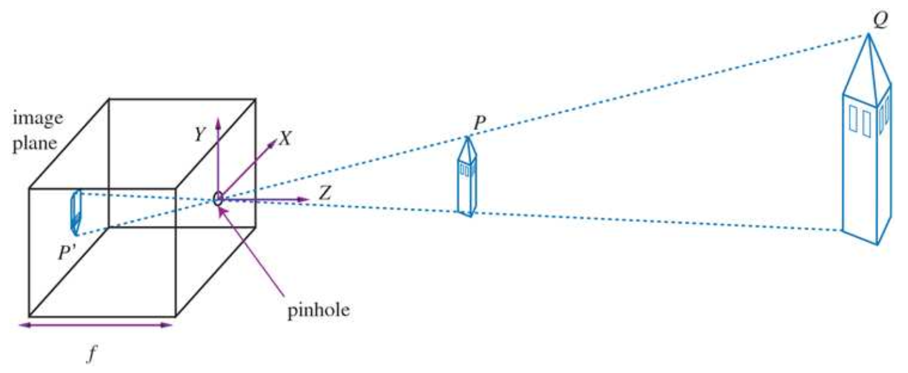
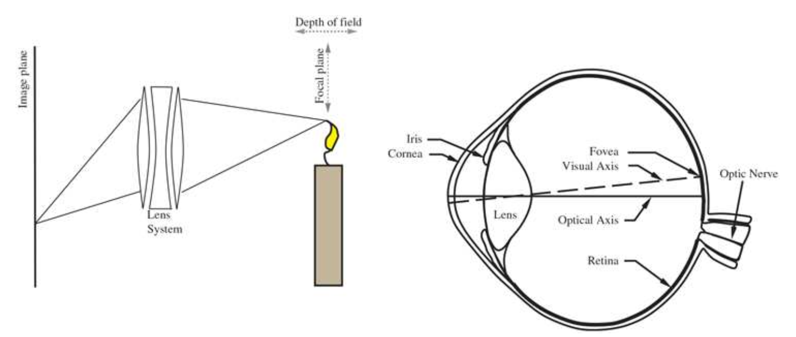
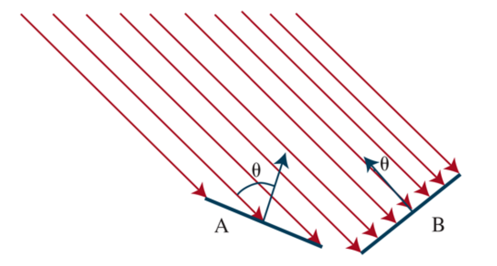
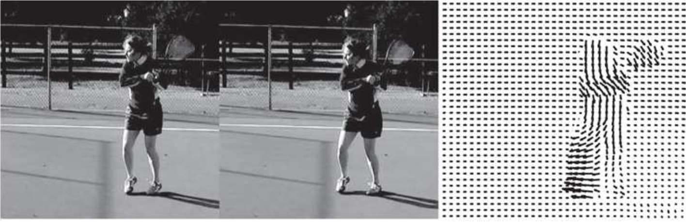
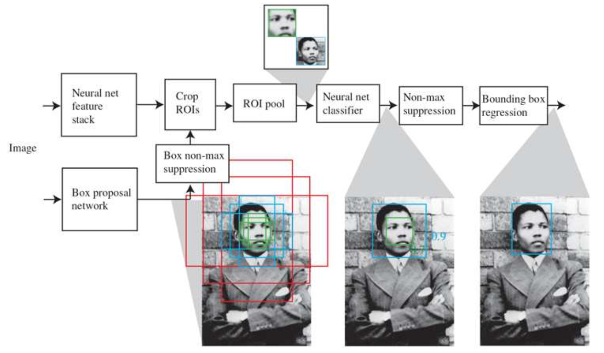
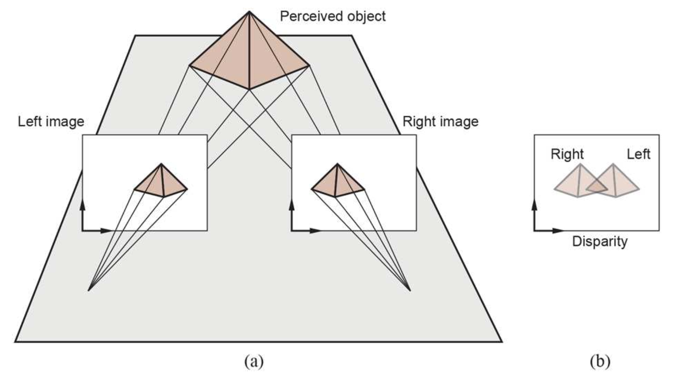
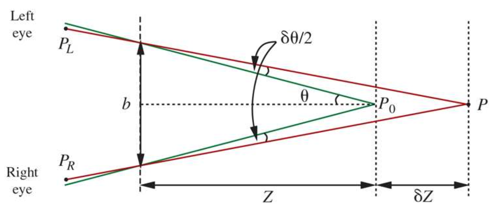

# Chapter 25: Computer Vision

- Seeing enables one to predict the future and act accordingly
- Goal of the chapter: how to recover information from eye/camera data

---

---

# 25.1 Introduction

- Visions is a perceptual channel that accepts stimuli
    - Passive sensing: vision without needing to send out light
    - Active sensing: sending out a signal to see (eg radar)
- Physical + statistical phenomena of sensing
- Feature: number obtained after applying simple computations to an image
    - Feature extraction approach
- Model-based approach to vision
    - Object model
    - Rendering model
- Managing ambiguities in a seen object
    - Likeliness
    - Insignificance
- Two core problems of computer vision: reconstruction & recognition

# 25.2 Image Formation

- Images are distorted representations of objects (eg foreshortening)
    - Scene
    - Image (2D)
    - Formed in an image plane
        - Sensor
        - Light arrives as photons with varying wavelengths, producing electrical effects of varying strength
            - We sum the effects over a time window
    - Pixels

## 25.2.1 Images without lenses: The pinhole camera

- Focused images
    
    
    
    - Use a pinhole camera to ensure light comes from the same spot in the world
    - Opening is called the aperture
    - Moving objects are subject to motion blur
- Perspective projection: $\frac{-x}{f} = \frac{X}{Z}, \frac{-y}{f} = \frac{y}{Z} \Rightarrow x = \frac{-fX}{Z}, y = \frac{-fY}{Z}$
    - f is the focal length
    - Z means the further an object is, the smaller its image will be
    - the $-$ sign means the image will be inverted
- A line in the scene in the direction $(U,V,W)$ and passing through the point $(X_0,Y_0,Z_0)$ can be described as the set of points $(X_0+\lambda U,Y_0+\lambda V,Z_0+\lambda W)$
    - $\lambda$ varies from $-\infin$ to $+ \infin$
- Projection of a point $P_\lambda$ from the line  onto the image plane: $P_\lambda = (f\frac{X_0+\lambda U}{Z_0+\lambda W}, f\frac{Y_0+\lambda V}{Z_0+\lambda W})$
    - Vanishing point: $P_\infin = (\frac{fU}{W}, \frac{fV}{W})$ if $W≠0$
        - That means two parallel lines will converge

## 25.2.2 Lens systems

- Lens systems are used to refocus images when we have a larger aperture
    
    
    
    - Light is focused only within a range $Z$ depths from a lens
    - Focal plane: center of the range, sharpest focus
    - Depth of field: range of depths with sharp enough focus
- To focus on something at another distance, move the lens elements back and forth

## 25.2.3 Scaled orthographic projection

- Simplified model for when perspective imaging effects are not very pronounced (close objects eg)
- If $Z$  in $Z_0 ±\triangle Z$, with $\triangle Z <<Z_0$:
    - Perspective scaling factor ($f/Z)$ $= s = f/Z_0$
        
        ⇒ $x=sX, y=sY$
        

 

## 25.2.4 Light and shading

- Brightness of a pixel: function of the brightness of the surface patch
- Use of a linear model of image brightness
- Three factors that contribute to the amount of light coming from a point in an image
    - overall intensity of ambient light
    - orientation of the point toward the light or in shadows
    - amount of light reflecting from the point
- Diffuse reflection 🆚 specular reflection
    - Diffuse reflection: Light scatters evenly across all directions
    - Specular reflection: Light leaves the object in a lobe of directions
        - Creates specularities (bright spots) that moves when the object or light move
- Modeled using a **distant point light source**
    
    
    
    - Brightness of a diffuse patch (Lambert’s cosine law): 
    $I=\rho I_0 cos \theta$
        - $\rho$ is the **diffuse albedo** coefficient
        - $I_0$ is the intensity of the light source
        - $\theta$  is the angle between the light source and the surface normal
    - **Shadows** happen when a surface cannot see the light source
    - **Interreflections** are sources of light coming from reflections on other objects
        - **Ambient illumination** is often used to represent it as a constant

## 25.3.5 Color

- Principle of trichromacy: The visual appearance of any spectral energy density can be matched using three primaries
    - RGB ⇒ Three numbers per pixel can describe color
- Color constancy: capacity for humans to ignore effects of colored lights

# 25.3 Simple Image Features

- We often use simplified representations with reduced details
- Four properties of images: edges, texture, optical flow, regions

## 25.3.1 Edges

- Straight lines or curves that show a significant change in image brightness
    - Big difference in pixel intensity ⇒ early or low-level operation
- Causes of edges: depth discontinuities (color change), change in surface normal, in surface reflectance (image intensities change), apparition of a shadow (discontinuity in illumination)
- Identifying edge: take $I'(x)$
    - Denoising/smoothing can be needed to avoid false positives
        - Application of a Gaussian filter: 
        $G_\sigma (x)= \frac{1}{\sqrt{2\pi \sigma^2}}e^{-x^2/2\sigma ^2}$
        $G_\sigma (x,y)= \frac{1}{\sqrt{2\pi \sigma^2}}e^{-(x^2+y^2/2)\sigma ^2}$
        - We replace $I(x_0, y_0)$ with the weighted sum of the two functions $I(x,y)$ and $G_\sigma (d)$ over all $(x,y)$pixels where $d$ is the distance from $(x_0, y_0)$ to $(x,y)$
            - Also called a **convolution**, written $h=f*g$**:
            $h(x)=\sum^{+\infin}_{u=-\infin}f(u)g(x-u)$
            $h(x,y)=\sum^{+\infin}_{u=-\infin}\sum^{+\infin}_{v=-\infin}f(u,v)g(x-u,y-v)$**
        - Smoothing function is achieved by convolving the image with the Gaussian $I*G_\sigma.A$
            - We usually replace $±\infin$ with $±3\sigma$
    - Combining smoothing and edge finding
        - Simply convolve the image with the derivative of the Gaussian smoothing function because $(f*g)' = f*g'$
    - Generalization to 2D images
        - Gradient of the image brightness with edge at angle $\theta$$\nabla I = (\frac{\frac{\partial{I}}{\partial{x}}}{\frac{\partial{I}}{\partial{y}}})$
        - Direction of the gradient: $\frac{\nabla I}{||\nabla I||} = (\frac{cos\theta}{sin\theta})$ (does not change with varying brightness)
        - Edge orientation at every pixel: $\theta = \theta(x,y)$ (does not depend on image intensity)
        - At edge points, the gradient magnitude is a local max along the direction of the gradient
    - We link edge pixels by assuming neighboring edge pixels are on the same curve

## 25.3.2 Texture

- Texture is a (usually roughly regular, sometimes quite periodic (see texels)) pattern on a surface
    - Property of an image patch
- Texture representations
    - Objects identification
    - Patches matching between images
- Basic construction for texture representation: compute gradient orientation for image patch, histogram of orientations
- Size of the patch to describe: use convnet

## 25.3.3 Optical flow

- Optical flow: Direction and speed of motion of features in the image as a result of relative motion between the viewer and the scene
    
    
    
- Optical flow vector field $v_x(x,y), v_y=(x,y)$
    - Find corresponding points between images using intensity patterns similarity
        - Sum of squared differences (SSD): $SSD(D_x, D_y)=\sum_{(x,y)}(I(x,y,t)-I(x+D_x,y+D_y,t+D_t))^2$
        - Optical flow at $(x_o,y_o)$: $(x_x, v_y)=(D_x/D_t, D_y/D_t)$
            - We need some texture in the scene ⇒ significant variation in brightness

## 25.3.4 Segmentation of natural images

- Breaking images in groups of similar pixels (regions)
    - Detecting boundaries 🆚 detecting the regions themselves
        - Boundaries do not guarantee closed curves and does not use global consistency constraints
        - Clustering the pixels into regions can be set up as a graph partitioning problem
    - Classification problem

# 25.4 Classifying Images

- Classifying image of object 🆚 images containing multiple objects
- Classify using appearance
    - Some effects can change the appearance of a single object: lighting, foreshortening (distortion of a pattern because of an angle), aspect, occlusion, deformation

## 25.4.1 Image classification with convolutional neural networks

- Given sufficient data, it performs better than manually crafting features

## 25.4.2 Why convolutional neural networks classify images well

- Conv layer + ReLu activation function ⇒ local pattern detector
- Convolution with multiple kernels finds multiple patterns
- Data set augmentation to increase data availability
- CNN-based classifiers are good at ignoring patterns that aren’t discriminative
- Use of context

# 25.5 Detecting Objects

- Find multiple objects in an image: *what* is there, *where* it is (using bounding box)
- Use of sliding windows
    - Details to work out
        1. Decide on a window shape
        2. Build a classifier for windows
        3. Decide which windows to look at
        4. Choose which windows to report
        5. Report precise locations of objects using windows
- Find regions (coherent color and texture) and classify it as object (’objectness’) ⇒ regional proposal network (RPN)
    - Stride of 16 pixels from the center of each center point for each box
    - Consider multiple box sizes: anchor boxes
- Neural network architecture
    - Region of interest
    - ROI pooling
- Deciding which window to report
    - Greedy algorithm called non-maximum suppression
- Precise location of objects
    - Bounding box regression
    - Balance **recall** (true positives) and **precision** (true negatives)

# 25.6 The 3D World

- 2D world full of cues about the 3D one (eg multiple pictures of the same world, or within a single picture)

## 25.6.1 3D cues from multiple views

- Two views can be better for several reasons
    - Enough viewpoints + information about the two cameras = 3D model
    - Use multiple views of a single point leads to four coordinates in a three variables problem
- Key problem: correspondance
    - Produce geometric constraints (two cameras, moving)

## 25.6.2 Binocular stereopsis

- Disparity from one camera/eye to the other
    
    
    
- To measure disparity, we need to solve the correspondence problem
    - Analogous to measuring optical flow
    - Relationship between right and left camera represented by a displacement along the $x$-axis by a baseline $b$
        - Translation vector $\bold{T}$ acting for time $\delta t$ with: $T_x=b/\delta t$ and $T_y=T_z=0$
        - Horizontal and vertical disparity: $H=v_x\delta t, V=v_y\delta$
        - We get:  $H=b/Z, V=0$
    - Angular disparity: $\delta \theta /2 = \frac{b/2}{Z} - \frac{b/2}{Z+\delta Z} \approx \frac{b\delta Z}{2Z^2}$
        
        
        
    - disparity $= \frac{b\delta Z}{Z^2}$

## 25.6.3 3D cues from a moving camera

- Optical flow field (assuming focal length $f=1$): $v_x(x,y)=\frac{-T_x+xT_z}{Z(x,y)}$ and $v_y(x,y)=\frac{-T_y+yT_z}{Z(x,y)}$
    - Focus of expansion: poitn where $x=T_x/T-z, y=T_y/T_z$ both equal $0$
    - If we move the origin to the focus of expansion. $(x',y')$ are the new coordinates defined by $x'=x-T_x/T-z, y'=y-T_y/T_z$. Then:  $v_x(x',y')=\frac{x'T_z}{Z(x',y')}, v_y(x',y')=\frac{y'T_z}{Z(x',y')}$
        - Time to contact: $Z/T_z$
        - Motion parallax: $Z_1/Z_2$

  

## 25.6.4 3D cues from one view

- Occlusion, texture, shading-variation , spatial relations between objects can be sources of information
- Looks depend on pose

# 25.7 Using Computer Vision

## 25.7.1 Understanding what people are doing

- Human-computer interfaces design
- Reliance on context and time scale
- Difficulties because unrelated behaviors can be happening at the same time, many things can be happening in many contexts

## 25.7.2 Linking pictures and words

- Tagging systems
- Captioning systems
    - convnet + recurrent network or transformer
- Systems can hide ignorance by omitting details or using contextual cues but that’s prone to bias
    - Visual question answering or VQA system
    - Visual dialog system

## 25.7.3 Reconstruction from many views

- Matching points → extend to groups of images
- Applications: model building, mix animation with live actors in video, path reconstruction, construction management

## 25.7.4 Geometry from a single view

- Prediction of a depth map → use convnet

## 25.7.5 Making pictures

- Train model on image transformation
- GANs
    - Deepfake creation
- Style transfer (content and style in images are often done by late and early layers respectively)

## 25.7.6 Controlling movement with vision

- Manipulating objects and navigating
- Self driving car: lateral and longitudinal control, obstacle avoidance, obey traffic signals
    - Use of variety of sensors, not only vision
- Mobile robots navigating: map building, path planning

# 25.S Summary

- Goal of vision: extract information needed for manipulation, navigation, and object recognition
- Geometry and optics of image formation if well understood
    - graphics problem: camera position → image (easy)
    - computer vision problem: image → 3D description (more difficult)
- Representation of images capture edges, texture, optical flow, regions
- Convnets produce accurate image classifiers by using patterns of patterns of patterns…
- Image classifiers can be turned into object detectors
- With multiple views of a scene, possible to recover 3D structure and relationship between views

# 25.E Exercices