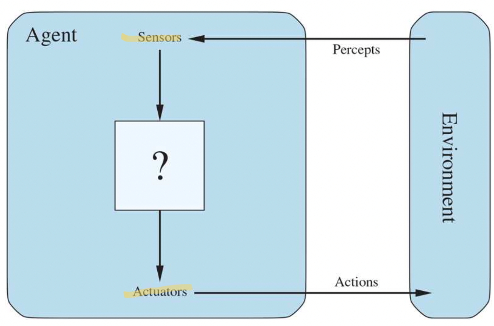
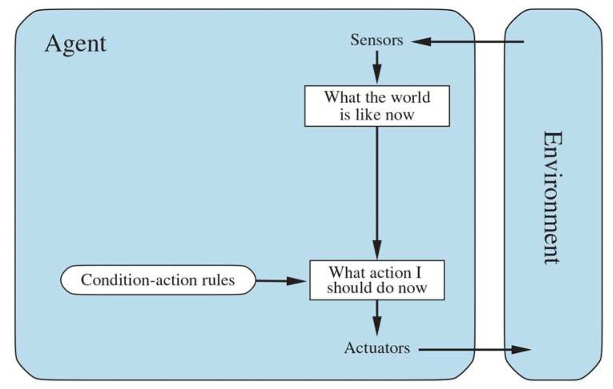
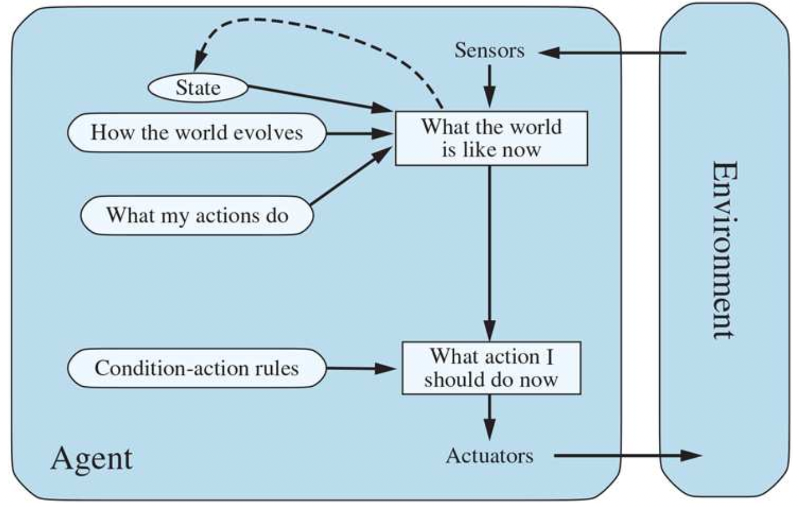
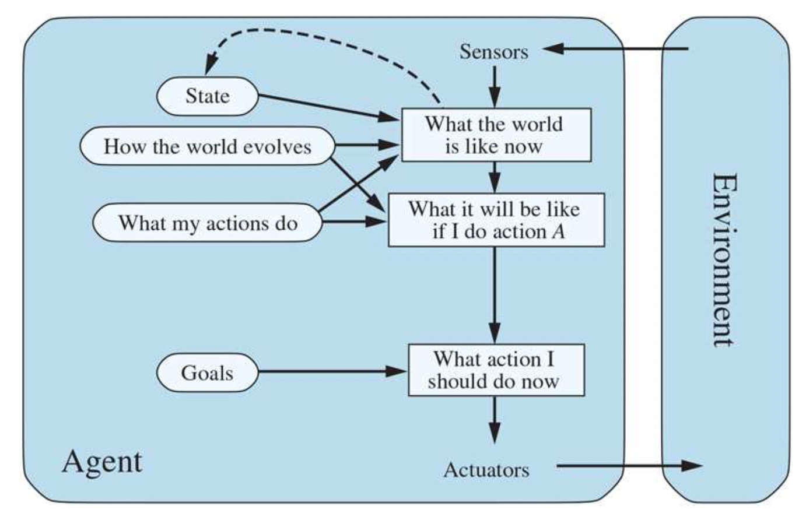
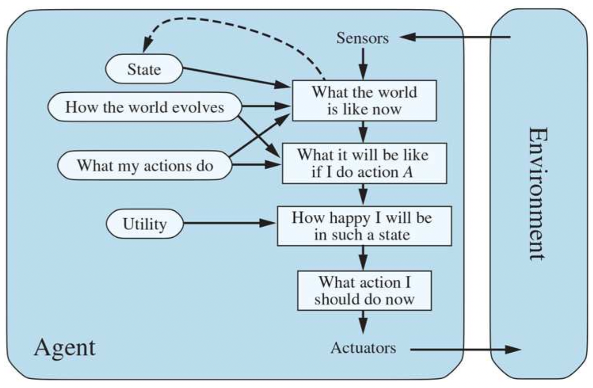
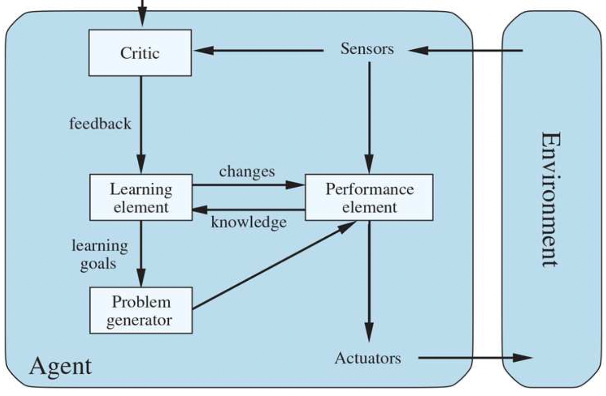
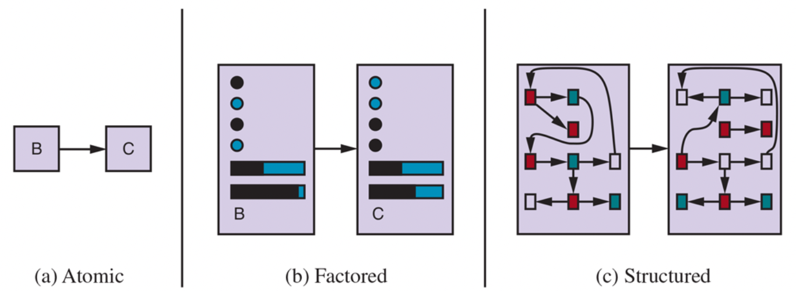

# Chapter 2: Intelligent agents

---

# **2.1   Agents and environments**

- Un agent perçoit son environnement grâce à des *sensors* et agit sur cet environnement grâce à des *actuators*
    
    
    
- Un *percept* ****est le contenu qu’un sensor perçoit
    - Une *percept sequence* est l’entiereté historique des percepts
    - Une *agent function* fait le lien entre des percepts et des actions
        - Externe : Description mathématique abstraite
    - Un *agent program* est une implémentation concrète de la function sur un système physique
        - Interne

# **2.2   Good Behavior: The Concept of Rationality**

- Un agent rationnel fait la chose juste
    
    → Mesure de performance
    
- Incertitude potentielle autour de l’objectif → En tenir compte dans le design de l’agent

<aside>
🧠 Définition d’un agent rationnel : *For each possible percept sequence, a rational agent should select an action that is expected to maximize its performance measure, given the evidence provided by the percept sequence and whatever built-in knowledge the agent has.*

</aside>

- Rationalité >< omniscience
    - Maximiser la performance *attendue* → accumuler des informations et apprendre (*learning*)

# **2.3   The Nature of Environments**

- On doit définir le *task environment*
    - PEAS (**P**erformance, **E**nvironment, **A**ctuators, **S**ensors)
- Propriété des *task environments*
    
    
    | Simple | Complex |
    | --- | --- |
    | Fully observable | Partially observable |
    | Single-agent | Multiagent |
    | Deterministic | Nondeterministic |
    | Episodic | Sequential |
    | Static | Dynamic |
    | Discrete | Continuous |
    | Known | Unknown |

# **2.4   The Structure of Agents**

- Job of AI: Implémenter l’agent function dans un agent program
- `agent = architecture + program`
- Quatre types basiques d’**agent programs**

## Simple reflex agents

- N’utilise que le percept actuel ⇒ environnement totalement observable
- *Randomization* des actions pour sortir des boucles



Simple reflex agent

## Model-based reflex agents

- Environnement partiellement observable
- Possède un état interne dépendant de l’historique de percepts
- *Transition model of the world*: Impact des actions de l’agent sur l’environnement et évolution indépendante de ce dernier
- *Sensor model*: Réflexion de l’impact de l’état du monde sur les percepts
- `Transition model + sensor model = model-based agent`



Model-based reflex agent

## Goal-based agents

- Combiner le modèle avec des informations sur l’objectif que l’agent poursuit
- Considération pour le futur



Goal-based agent

## Utility-based agents

- Comparaison d’états du monde potentiels en fonction de l’utilité attendue



Utility-based agent

## Learning agents

- *Learning element* (améliorations) vs *performance element* (sélection des actions)
- *Critic*
- *Problem generator:* Suggère des actions à prendre faire des expériences enrichissantes



Learning agents

- *Reward vs penalty*
- Fonctionnement des composants d’un agent program
    
    
    
    - *Atomic*
        - Pas de structure interne
    
    - *Factored*
        - Variables ou attributs fixés à certaines valeurs
    
    - *Structured*
        - *Relations* entre des *objets*

# 2.A   Exercises

1. Suppose that the performance measure is concerned with just the first 𝑇 time steps of the environment and ignores everything thereafter. Show that a rational agent’s action may depend not just on the state of the environment but also on the time step it has reached.
    1. If reward coming from moving from S’ to S is greater than staying immobile or going from S to S’, it can still be rational to do the latter if the agent is in S and if only one move can still be computed as part of the performance measure. Indeed, it will not have time to gather the reward from S’ to S if it can only do one action.
2. Let us examine the rationality of various vacuum-cleaner agent functions.
1. Show that the simple vacuum-cleaner agent function described in Figure [2.3](https://aimacode.github.io/aima-exercises/figures/vacuum-agent-function-table.png) is indeed rational under the assumptions listed on page
2. Describe a rational agent function for the case in which each movement costs one point. Does the corresponding agent program require internal state?
3. Discuss possible agent designs for the cases in which clean squares can become dirty and the geography of the environment is unknown. Does it make sense for the agent to learn from its experience in these cases? If so, what should it learn? If not, why not?
    1. The agent is rational because there is no agent that could perform the task more efficiently. If one place is dirty, suck or go there to suck after one step. If everything is dirty, clean then move and clean. If everything is clean, there is no way to do any better.
    2. Because it costs one point to move, an agent would need an internal state to keep track of which square has been cleaned or not. Indeed, if a square has just been cleaned, it would make more sense to wait than to check it out again. Because the environment is only partially observable, the agent can’t take a rational decision if it doesn’t have an internal state.
    3. Learning from experience in this case could provide the agent with ways to devise an optimal search pattern for dirt (does it appear after a specific amount of time, does the agent’s movements affect it, etc) and make it able to clean in the least possible amount of steps.
3. Write an essay on the relationship between evolution and one or more of autonomy, intelligence, and learning.
    1. Evolution revolves around the idea of survival of the fittest. Adaptation (by design or by chance because of mutations) is key. The ability to learn gives an inherent advantage to an agent because it enables it to fit itself to the environment without need for a new generation. Intelligence helps learning so is de facto an advantage.
4. For each of the following assertions, say whether it is true or false and support your answer with examples or counterexamples where appropriate.
1. An agent that senses only partial information about the state cannot be perfectly rational.
2. There exist task environments in which no pure reflex agent can behave rationally.
3. There exists a task environment in which every agent is rational.
4. The input to an agent program is the same as the input to the agent function.
5. Every agent function is implementable by some program/machine combination.
6. Suppose an agent selects its action uniformly at random from the set of possible actions. There exists a deterministic task environment in which this agent is rational.
7. It is possible for a given agent to be perfectly rational in two distinct task environments.
8. Every agent is rational in an unobservable environment.
9. A perfectly rational poker-playing agent never loses.
    1. False, perfect rationality means making the most of whatever you have.
    2. True, eg the vacuum cleaner above.
    3. True, single state environment and single value reward eg.
    4. False*, agent function:* link between all percepts and action; *agent program:* link between current percept and action
    5. False, eg halting problem (can be formulated on agent function but not solved by program) or intractable problems
    6. True, if we have eg an agent in a single state world where the only action is do nothing.
    7. True, for a number of examples, like the non-costly vacuum world where you can add a square or remove one and the agent is still rational.
    8. False, you can use an internal model for example.
    9. False, there is uncertainity so probabilistic decision making can fail you.
5. For each of the following activities, give a PEAS description of the task environment and characterize it in terms of the properties listed in Section
    
    
    | Simple | Complex |
    | --- | --- |
    | Fully observable | Partially observable |
    | Single-agent | Multiagent |
    | Deterministic | Nondeterministic/Stochastic |
    | Episodic | Sequential |
    | Static | Dynamic |
    | Discrete | Continuous |
    | Known | Unknown |
    1. Playing soccer: *Partially observable, Multiagent, Stochastic, Sequential, Dynamic, Continuous.*
    2. Exploring the subsurface oceans of Titan: *Partially observable, Single-agent, Stochastic, Sequential, Dynamic, Continuous.*
    3. Shopping for used AI books on the Internet: *Partially observable* (pricing algorithms, impact external factors on prices, etc)*, Multiagent* (other buyers)*, Stochastic, Sequential, Dynamic, Continuous.*
    4. Playing a tennis match: *Fully observable, Multiagent, Stochastic, Episodic, Dynamic, Continuous*
    5. Practicing tennis against a wall: *Fully observable, Single-agent, Deterministic, Episodic, Static, Continuous*
    6. Performing a high jump: *Fully observable, Single-agent, Deterministic, Episodic, Static, Discrete*
    7. Knitting a sweater: *Fully observable, Single-agent, Deterministic, Sequential, Static, Discrete*
    8. Bidding on an item at an auction: *Fully observable, Multiagent, Stochastic, Sequential, Dynamic, Discrete*
6. Define in your own words the following terms: 
    1. Agent: Entity able to act in a given environment using its own decision making capabilities (deciding and acting) and sense the response of its environment (sensing reactions).
    2. Agent function: Function that links the percept history to an action.
    3. Agent program: Function that links the current percept to an action.
    4. Rationality: Taking the best decision in a given environment given a certain amount of information.
    5. Autonomy: Ability of an agent to act on its own.
    6. Reflex agent: Agent that acts using only the current percept.
    7. Model-based agent: Agent that acts using the percept history thanks to its internal model of the environment.
    8. Goal-based agent: Agent capable of maximizing its performance by mapping its actions to potential reactions from the environment.
    9. Utility-based agent: Agent capable of maximizing its utility by mapping its actions to potential reactions from the environment.
    10. Learning agent: Agent capable of improving thanks to experience.
7. This exercise explores the differences between agent functions and agent programs.
1. Can there be more than one agent program that implements a given agent function? Give an example, or show why one is not possible.
2. Are there agent functions that cannot be implemented by any agent program?
3. Given a fixed machine architecture, does each agent program implement exactly one agent function?
4. Given an architecture with 𝑛 bits of storage, how many different possible agent programs are there?
5. Suppose we keep the agent program fixed but speed up the machine by a factor of two. Does that change the agent function?
    1. Yes, there are multiples ways of doing the same thing.
    2. Yes, intractable problems eg.
    3. Yes.
    4. Each bit in digital storage can have two possible states: 0 or 1. With n bits, each bit independently can be in one of 2 states. Therefore, the total number of unique combinations of n bits is 2n. We know that an agent program is defined by the particular configuration of bits in its storage, so the number of different possible agent programs corresponds to the number of unique configurations of the n bits: $2^n$.
    5. It depends on how time influences the program.
8. Write pseudocode agent programs for the goal-based and utility-based agents.
    1. Goal-based agent:
        
        ```markdown
        **function** GOAL-BASED-AGENT(*percept*) **returns** an *action*
        	**persistent**: *state*, the agent’s current conception of the world state
        							*model* , a description of how the next state depends on current state and action goal, a description of the desired goal state
        							*plan*, a sequence of actions to take, initially empty
        							*action*, the most recent action, initially none
        							
        	*state* <- UPDATE-STATE(*state, action, percept, model*)
        	**if** GOAL-ACHIEVED(*state*,*goal*) **then** **return** a *null action* 
        	**if** *plan* is empty **then**
        *plan* ← PLAN(*state, goal, model*) 
        	*action* ← FIRST(*plan*)
        	*plan* ← REST(*plan*)
        	**return** *action*
        ```
        
    2. Utility-based agent — Same with no “goal achieved” state:
        
        ```markdown
        **function** UTILITY-BASED-AGENT(*percept*) **returns** an *action*
        	**persistent**: *state*, the agent’s current conception of the world state
        							*model*, a description of how the next state depends on current state and action goal, a description of the desired goal state
        							*plan*, a sequence of actions to take, initially empty
        							*action*, the most recent action, initially none
        							
        	*state* <- UPDATE-STATE(*state, action, percept, model*)
        	**if** *plan* is empty **then**
        *plan* ← PLAN(*state, goal, model*) 
        	*action* ← FIRST(*plan*)
        	*plan* ← REST(*plan*)
        	**return** *action*
        ```
        
9. Consider a simple thermostat that turns on a furnace when the temperature is at least 3 degrees below the setting, and turns off a furnace when the temperature is at least 3 degrees above the setting. Is a thermostat an instance of a simple reflex agent, a model-based reflex agent, or a goal-based agent?
    1. Simple reflex agent (How is the world? ⇒ action(enable, disable)).
10. Implement a performance-measuring environment simulator for the vacuum-cleaner world depicted in Figure [2.8](https://aimacode.github.io/aima-exercises/figures/vacuum-world-figure.png) and specified on page. Your implementation should be modular so that the sensors, actuators, and environment characteristics (size, shape, dirt placement, etc.) can be changed easily. (Note: for some choices of programming language and operating system there are already implementations in the online code repository.)
    1. Attempt in python:
        
        ```python
        class Environment:
            def __init__(self, size=2, agent_position=0, dirt_positions=None):
                self.size = size
                self.dirt_positions = dirt_positions if dirt_positions else [False] * size
                self.agent_position = agent_position
            
            def is_dirty(self, position):
                return self.dirt_positions[position]
            
            def clean(self, position):
                self.dirt_positions[position] = False
            
            def move_agent(self, new_position):
                if 0 <= new_position < self.size:
                    self.agent_position = new_position
            
            def get_agent_position(self):
                return self.agent_position
            
            def is_clean(self):
                return all(not dirty for dirty in self.dirt_positions)
        
        class Agent:
            def __init__(self, environment):
                self.environment = environment
                self.performance_score = 0
            
            def perceive(self):
                position = self.environment.get_agent_position()
                is_dirty = self.environment.is_dirty(position)
                return position, is_dirty
            
            def act(self, perception):
                position, is_dirty = perception
                if is_dirty:
                    print("---> Dirt found, cleaning. :-]")
                    self.environment.clean(position)
                    self.performance_score += 1
                else:
                    print("---> No dirt found, moving to other square. :-]")
                    new_position = (position + 1) % self.environment.size
                    self.environment.move_agent(new_position)
                    self.performance_score -= 1
        
            def get_performance_score(self):
                return self.performance_score
        
        def run_simulation(environment, agent, steps=10):
            for step in range(steps):
                print(f"Step {step + 1}: Position: {environment.get_agent_position()}, Dirt: {environment.dirt_positions[environment.get_agent_position()]}, Performance: {agent.get_performance_score()}")
                perception = agent.perceive()
                agent.act(perception)
                if environment.is_clean():
                    print(f"Final performance score: {agent.get_performance_score()}")
                    break
            return agent.get_performance_score()
        
        potential_dirt_pos = [[True, True], [True, False], [False, True], [False, False]]
        potential_agent_pos = [0, 1]
        possibilities = 1
        total_score = 0
        
        for dirt_pos in potential_dirt_pos:
            for agent_pos in potential_agent_pos:
                print("\n")
                print(f"Run number: {possibilities} -- Starting position is {agent_pos}, dirt positions is {dirt_pos}.")
                environment = Environment(agent_position=agent_pos, dirt_positions=dirt_pos.copy())
                agent = Agent(environment)
                total_score += run_simulation(environment, agent, steps=10)
                possibilities += 1
        
        print("\n")
        print("------------------------------------------------")
        average_score = total_score / (possibilities-1)
        print(f"Here is the average score: {average_score}.")
        ```
        
11. Implement a simple reflex agent for the vacuum environment in Exercise [2.10](https://aimacode.github.io/aima-exercises/agents-exercises/ex_10). Run the environment with this agent for all possible initial dirt configurations and agent locations. Record the performance score for each configuration and the overall average score.
    1. See class “Agent” above. Here is how the runs played out:
        
        ```python
        Run number: 1 -- Starting position is 0, dirt positions is [True, True].
        Step 1: Position: 0, Dirt: True, Performance: 0
        ---> Dirt found, cleaning. :-]
        Step 2: Position: 0, Dirt: False, Performance: 1
        ---> No dirt found, moving to other square. :-]
        Step 3: Position: 1, Dirt: True, Performance: 0
        ---> Dirt found, cleaning. :-]
        Final performance score: 1
        
        Run number: 2 -- Starting position is 1, dirt positions is [True, True].
        Step 1: Position: 1, Dirt: True, Performance: 0
        ---> Dirt found, cleaning. :-]
        Step 2: Position: 1, Dirt: False, Performance: 1
        ---> No dirt found, moving to other square. :-]
        Step 3: Position: 0, Dirt: True, Performance: 0
        ---> Dirt found, cleaning. :-]
        Final performance score: 1
        
        Run number: 3 -- Starting position is 0, dirt positions is [True, False].
        Step 1: Position: 0, Dirt: True, Performance: 0
        ---> Dirt found, cleaning. :-]
        Final performance score: 1
        
        Run number: 4 -- Starting position is 1, dirt positions is [True, False].
        Step 1: Position: 1, Dirt: False, Performance: 0
        ---> No dirt found, moving to other square. :-]
        Step 2: Position: 0, Dirt: True, Performance: -1
        ---> Dirt found, cleaning. :-]
        Final performance score: 0
        
        Run number: 5 -- Starting position is 0, dirt positions is [False, True].
        Step 1: Position: 0, Dirt: False, Performance: 0
        ---> No dirt found, moving to other square. :-]
        Step 2: Position: 1, Dirt: True, Performance: -1
        ---> Dirt found, cleaning. :-]
        Final performance score: 0
        
        Run number: 6 -- Starting position is 1, dirt positions is [False, True].
        Step 1: Position: 1, Dirt: True, Performance: 0
        ---> Dirt found, cleaning. :-]
        Final performance score: 1
        
        Run number: 7 -- Starting position is 0, dirt positions is [False, False].
        Step 1: Position: 0, Dirt: False, Performance: 0
        ---> No dirt found, moving to other square. :-]
        Final performance score: -1
        
        Run number: 8 -- Starting position is 1, dirt positions is [False, False].
        Step 1: Position: 1, Dirt: False, Performance: 0
        ---> No dirt found, moving to other square. :-]
        Final performance score: -1
        
        ------------------------------------------------
        Here is the average score: 0.25.
        ```
        
12. Consider a modified version of the vacuum environment in Exercise [1](https://aimacode.github.io/aima-exercises/agents-exercises/ex_10)0, in which the agent is penalized one point for each movement.
1. Can a simple reflex agent be perfectly rational for this environment? Explain.
2. What about a reflex agent with state? Design such an agent.
3. How do your answers to 1 and 2 change if the agent’s percepts give it the clean/dirty status of every square in the environment?
    1. In our case, the agent is rational because it has access to an information about the state of the world: is it clean or not. If this wasn’t the case, it wouldn’t be rational.
    2. It would be rational.
    3. That’s a variant of what we have here. It would be rational because no other agent would be able to do a better job.